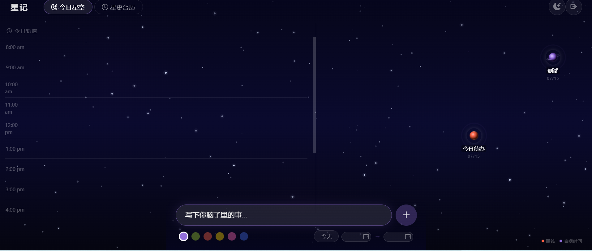
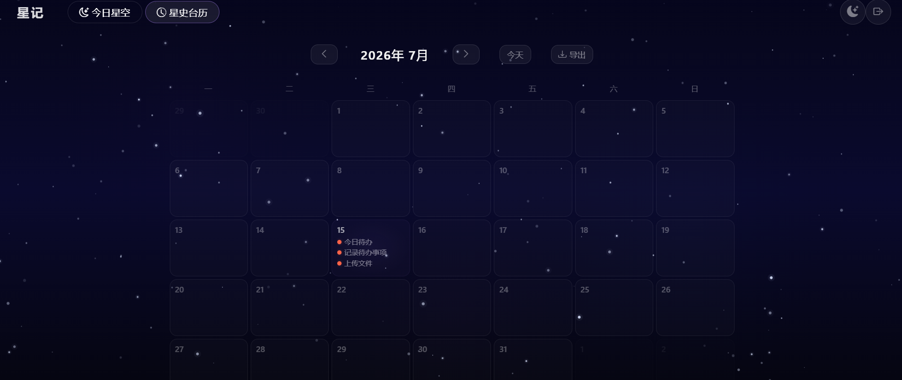
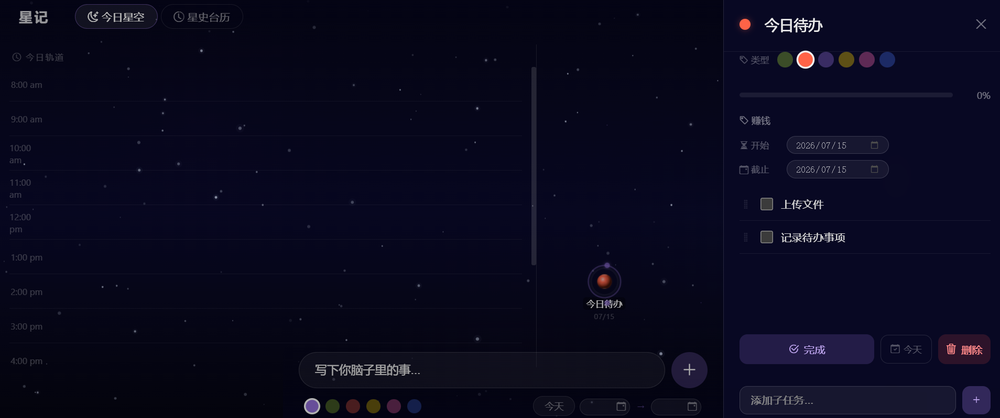

# 星记 桌面版

> 把你的日常待办化作星空。

<p align="center">
  
</p>

## 下载与使用

GitHub Release 提供两种产物，按需选择：

### ① 安装版 `星记-Setup.exe`（推荐普通用户）

1. 下载 `星记-Setup.exe`
2. 双击运行 → 标准安装向导 → 选择安装目录（默认 `文档\星记`，可改任意位置）
3. 安装程序自动：
   - 把 exe 安装到所选目录
   - 在桌面创建快捷方式
   - 自动启动 → 打开浏览器进入星空
4. 以后从桌面快捷方式启动即可

**数据存放位置**：exe 同路径（即你选择的安装目录）

### ② 绿色版 `star-track-desktop.exe`（高级用户）

1. 下载 `star-track-desktop.exe`
2. 放到任意目录（比如 `D:\星记`）
3. 双击运行 → 自动打开浏览器进入星空
4. 数据自动生成在 exe 同路径，备份整个目录即可迁移

### 默认账号

用户名：`pilot`
密码：`startrack`

### 修改密码

在数据目录找到 `.env` 文件，修改：

```ini
AUTH_USER=你的用户名
AUTH_PASS=你的新密码
```

保存后重启程序即可生效。`AUTH_PASS` 支持两种填写方式：

- **直接填新密码明文**（推荐）：启动时自动转换为 SHA256 哈希存储，明文不落盘
- **填 SHA256 哈希值**（64 位十六进制）：程序直接使用，不再转换

> 安全说明：程序不会以明文形式存储密码。`.env` 中保存的始终是密码的 SHA256 哈希。

### 忘记密码

不用慌，数据都还在。两种方式任选：

**方式一：修改 .env（推荐，最简单）**

1. 打开数据目录的 `.env` 文件
2. 把 `AUTH_PASS=` 后面整段删掉，填入你想用的新密码明文
3. 保存，重启程序
4. 用新密码登录即可（程序会自动把它转换为哈希存储）

**方式二：删除 .env**

删除 `.env` 后重启，程序会生成一个随机密码并写入 `logs/server.log` 日志文件，打开日志搜索「新密码」即可找到。

> 无论哪种方式，任务数据（`data/todo.db`）都不受影响。

### 数据目录结构

```
（exe 同路径）
├── star-track-desktop.exe       # 主程序（仅绿色版可见，安装版在安装目录）
├── .env                         # 用户名和密码
├── data/
│   └── todo.db                  # SQLite 数据库（全部待办数据）
└── logs/
    └── server.log               # 运行日志
```

### 卸载

- **安装版**：控制面板 → 程序和功能 → 卸载「星记」（会一并清理 exe 同路径的 `data/`、`logs/`、`.env`，如需保留请先备份 `data/todo.db`）
- **绿色版**：直接删除 exe 同路径的整个目录

## 更多截图





## 构建方法

需要安装 Go 1.21+。本地编译：

```bash
go mod tidy
go build -ldflags="-H windowsgui" -o star-track-desktop.exe
```

打包安装版还需要 [Inno Setup 6](https://jrsoftware.org/isdl.php)：

```bash
iscc installer\star-track.iss
```

CI 自动构建见 `.github/workflows/build.yml`，push tag `v*` 触发。

## 技术栈

| 层级 | 技术 |
|------|------|
| 后端 | Go + modernc.org/sqlite |
| 前端 | 原生 JavaScript/CSS |
| 认证 | JWT（nonce 挑战 + SHA256 哈希） |
| 打包 | `embed` 静态资源嵌入 + Inno Setup 安装包 |

## 功能清单

- 今日星空双栏视图：时间轴 + 星座总览
- 六大星球分类（自我 / 学习 / 运动 / 赚钱 / 家庭 / 恋爱）
- 多级子任务 + 进度自动聚合
- 手动拖拽进度条
- 时间轴预约（按小时槽位安排）
- 暗色 / 亮色双主题
- 星史台历（历史完成记录，支持按日查看）
- CSV 导出（按月范围导出已完成任务）
- 任务详情面板（编辑标题、类型、日期、进度）

## 与 PHP 版的区别

- 无需 PHP 环境、无需 Web 服务器、无需 MySQL
- 双击即用，数据完全本地化
- 提供安装版与绿色版两种产物

## 许可

MIT